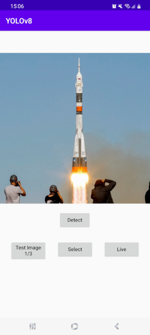

# Object Detection with YOLOv8 on Android

## Introduction

[YOLO](https://pjreddie.com/darknet/yolo/) (You Only Look Once) is one of the fastest and most popular object detection models. [YOLOv8](https://github.com/ultralytics/ultralytics) is an open-source implementation of the latest version of YOLO). This Object Detection with YOLOv8 Android sample app uses the PyTorch scripted YOLOv8 model to detect objects of the 4 classes trained with the [model](https://github.com/sunn-e/Google-Image-Downloader-Rocket-Dataset).

## Prerequisites

* PyTorch 1.12.0 and torchvision 0.13.0 (Optional)
* Python 3.10 (Optional)
* Android Pytorch library pytorch_android:1.12, pytorch_android_torchvision:1.12
* Android Studio 2022.1.1 or later

## Quick Start

To Test Run the Object Detection Android App, follow the steps below:

### 1. Prepare the model

If you don't have the PyTorch environment set up, you can use the model file `custom.torchscript` from the `android-demo-app/ObjectDetection/app/src/main/assets` directory, then skip the rest of this step and go to step 2 directly.

This `custom.torchscript` model is exported from custom trained model on  [model](https://github.com/sunn-e/Google-Image-Downloader-Rocket-Dataset).

In YOLOv8 version command line tools are added to help export the model and generate TorchScript-formatted YOLOv8 model named `yolov8.torchscript` for mobile apps.

If you want to use default model export do the following:

Open a Mac/Linux/Windows Terminal, run the following commands (note that we use the fork of the original YOLOv5 repo to make sure the code changes work, but feel free to use the original repo):

```
https://github.com/ultralytics/ultralytics
cd yolov8
pip3 install requirements.txt
```

Download [yolov8n](https://github.com/ultralytics/assets/releases/download/v0.0.0/yolov8n.pt)

Run command below to generate the optimized TorchScript lite model `yolov8.torchscript` and copy it to the `android-demo-app/ObjectDetection/app/src/main/assets` directory:

```
yolo export model=yolov8n.pt format=torchscript  # export official model
yolo export model=path/to/best.pt format=torchscript  # export custom trained model
```
Modify `classes.txt` file to add the default classes list. Modify the appropriate code in `MainActivity.java`, `ObjectDetectionActivity.java` and `PrePostProcessor.java` in order to use default model. 

### 2. Build with Android Studio

Start Android Studio, then open the project located in `android-demo-app/ObjectDetection`. Note the app's `build.gradle` file has the following lines:

```
implementation 'org.pytorch:pytorch_android:1.12'
implementation 'org.pytorch:pytorch_android_torchvision:1.12'
```

### 3. Run the app

Select an Android emulator or device to run the app. You can go through the included example test images to see the detection results. You can also select a picture from your Android device's Photos library, take a picture with the device camera, or even use live camera to do object detection - see this [video](https://drive.google.com/file/d/1-5AoRONUqZPZByM-fy0m7r8Ct11OnlIT/view) for a screencast of the app running.

Some example images and the detection results are as follows:




[//]: # (## Transfer Learning)

[//]: # ()
[//]: # (In this section, you'll see how to use an example dataset called [aicook]&#40;https://universe.roboflow.com/karel-cornelis-q2qqg/aicook-lcv4d/4&#41;, used to detect ingredients in your fridge, to fine-tune the YOLOv5 model. For more info on the YOLOv5 transfer learning, see [here]&#40;https://github.com/ultralytics/yolov5/issues/1314&#41;. If you use the default YOLOv5 model to do object detection on what's inside your fridge, you'll likely not get good results. That's why you need to have a custom model trained with a dataset like aicook.)

[//]: # ()
[//]: # (### 1. Download the custom dataset)

[//]: # ()
[//]: # (Simply go to [here]&#40;https://universe.roboflow.com/karel-cornelis-q2qqg/aicook-lcv4d/4&#41; to download the aicook dataset in a zip file. Unzip the file to your `yolov5` repo directory, then run `cd yolov5; mv train ..; mv valid ..;` as the aicook `data.yaml` specifies the `train` and `val` folders to be up one level.)

[//]: # ()
[//]: # (### 2. Retrain the YOLOv5 with the custom dataset)

[//]: # ()
[//]: # (Run the script below to generate a custom model `best.torchscript.pt` located in `runs/train/exp/weights`:)

[//]: # ()
[//]: # (```)

[//]: # (python train.py --img 640 --batch 16 --epochs 3 --data  data.yaml  --weights yolov5s.pt)

[//]: # (```)

[//]: # ()
[//]: # (The precision of the model with the epochs set as 3 is very low - less than 0.01 actually; with a tool such as [Weights and Biases]&#40;https://wandb.ai&#41;, which can be set up in a few minutes and has been integrated with YOLOv5, you can find that with `--epochs` set as 80, the precision gets to be 0.95. But on a CPU machine, you can quickly train a custom model using the command above, then test it in the Android demo app. Below is a sample wandb metrics from 3, 30, and 100 epochs of training:)

[//]: # ()
[//]: # (![]&#40;metrics.png&#41;)

[//]: # ()
[//]: # (### 3. Convert the custom model to lite version)

[//]: # ()
[//]: # (With the `export.py` modified in step 1 `Prepare the model` of the section `Quick Start`, you can convert the new custom model to its TorchScript lite version:)

[//]: # ()
[//]: # (```)

[//]: # (python export.py --weights runs/train/exp/weights/best.pt --include torchscript)

[//]: # (```)

[//]: # ()
[//]: # (The resulting `best.torchscript.ptl` is located in `runs/train/exp/weights`, which needs to be copied to the Android demo app's assets folder.)

[//]: # ()
[//]: # (### 4. Update the demo app)

[//]: # ()
[//]: # (In Android Studio, first in `MainActivity.java`, change line:)

[//]: # ()
[//]: # (```)

[//]: # (private String[] mTestImages = {"test1.png", "test2.jpg", "test3.png"};)

[//]: # (```)

[//]: # (to:)

[//]: # (```)

[//]: # (private String[] mTestImages = {"aicook1.jpg", "aicook2.jpg", "aicook3.jpg", "test1.png", "test2.jpg", "test3.png"};)

[//]: # (```)

[//]: # (&#40;The three aicook test images have been added to the repo.&#41;)

[//]: # ()
[//]: # (and change lines:)

[//]: # (```)

[//]: # (mModule = LiteModuleLoader.load&#40;MainActivity.assetFilePath&#40;getApplicationContext&#40;&#41;, "yolov5s.torchscript.ptl"&#41;&#41;;)

[//]: # (BufferedReader br = new BufferedReader&#40;new InputStreamReader&#40;getAssets&#40;&#41;.open&#40;"classes.txt"&#41;&#41;&#41;;)

[//]: # (```)

[//]: # (to:)

[//]: # (```)

[//]: # (mModule = LiteModuleLoader.load&#40;MainActivity.assetFilePath&#40;getApplicationContext&#40;&#41;, "best.torchscript.ptl"&#41;&#41;;)

[//]: # (BufferedReader br = new BufferedReader&#40;new InputStreamReader&#40;getAssets&#40;&#41;.open&#40;"aicook.txt"&#41;&#41;&#41;;)

[//]: # (```)

[//]: # (&#40;aicook.txt defines the 30 custom class names, copied from `data.yaml` in the custom dataset downloaded in step 1.&#41;)

[//]: # ()
[//]: # (Then in `PrePostProcessor.java`, change line `private static int mOutputColumn = 85;` to `private static int mOutputColumn = 35;`.)

[//]: # ()
[//]: # (Run the app in Android Studio and you should see the custom model working on the first three aicook test images:)

[//]: # ()
[//]: # (![]&#40;aicook1.png&#41;)

[//]: # (![]&#40;aicook2.png&#41;)

[//]: # ()
[//]: # (![]&#40;aicook3.png&#41;)

[//]: # (![]&#40;aicook4.png&#41;)

[//]: # ()
[//]: # (In order to do live object detection with the new custom model, just open `ObjectDetectionActivity.java` and replace `yolov5s.torchscript.ptl` in `mModule = LiteModuleLoader.load&#40;MainActivity.assetFilePath&#40;getApplicationContext&#40;&#41;, "yolov5s.torchscript.ptl"&#41;&#41;;` with `best.torchscript.ptl`.)
